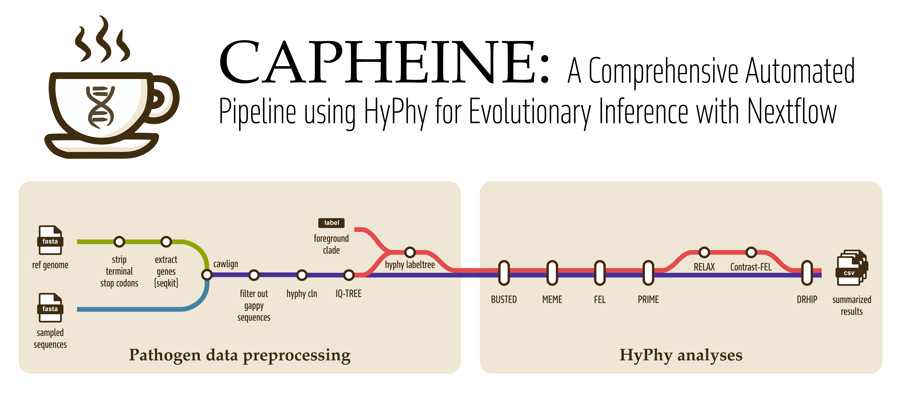

<h1>
  <picture>
    <source media="(prefers-color-scheme: dark)" srcset="docs/images/CAPHEINE-subway-diagram.png">
    
  </picture>
</h1>

[](https://github.com/veg/CAPHEINE/actions/workflows/ci.yml)
[](https://github.com/veg/CAPHEINE/actions/workflows/linting.yml)[](https://doi.org/10.5281/zenodo.XXXXXXX)
[](https://www.nf-test.com)

[](https://www.nextflow.io/)
[](https://docs.conda.io/en/latest/)
[](https://www.docker.com/)
[](https://sylabs.io/docs/)

## Introduction

**CAPHEINE** is a bioinformatics pipeline designed for comparative analysis of protein-coding genes using the HyPhy software suite. The pipeline ingests FASTA files containing raw DNA sequences along with FASTA files containing reference gene sequences, and performs multiple sequence alignment, phylogenetic tree construction, and various selection analyses. Key outputs include statistical tests for positive selection (BUSTED, FEL, MEME), branch-site models, and comprehensive quality control reports, all presented in an easy-to-interpret MultiQC report.

1. Ambiguous sequence removal
2. Multiple sequence alignment ([`cawlign`](https://github.com/evolbioinfo/cawlign))
3. Sequence deduplication and cleaning ([`HyPhy CLN`](https://hyphy.org/methods/selection-methods/))
4. Phylogenetic tree construction ([`IQ-TREE`](http://www.iqtree.org/))
5. Selection analyses using HyPhy:
   - [FEL](https://hyphy.org/methods/selection-methods/#FEL) (Fixed Effects Likelihood)
   - [MEME](https://hyphy.org/methods/selection-methods/#MEME) (Mixed Effects Model of Evolution)
   - [PRIME](https://hyphy.org/methods/selection-methods/#PRIME) (Probabilistic Inference of Molecular Evolution)
   - [BUSTED](https://hyphy.org/methods/selection-methods/#BUSTED) (Branch-Site Unrestricted Statistical Test for Episodic Diversification)
6. Optional branch-specific analyses when foreground branches are specified:
   - [Contrast-FEL](https://hyphy.org/methods/selection-methods/#CONTRAST-FEL)
   - [RELAX](https://hyphy.org/methods/selection-methods/#RELAX)
7. Collate and summarize results for all genes and analyses ([`DRHIP`](https://github.com/veg/drhip))

While CAPHEINE is not an official nf-core pipeline, it benefits from the nf-core ecosystem in several ways:

- **Development Standards**: Built using the nf-core template and follows nf-core best practices
- **Modular Design**: Uses the nf-core module system for maintainability
- **Containerization**: Leverages BioContainers for reproducible analyses
- **Testing Framework**: Utilizes nf-test for pipeline validation

This relationship allows CAPHEINE to maintain high standards of code quality and interoperability while allowing flexibility for the development roadmap and scope of the pipeline. Current scope is focused on viral non-recombinant data, but the pipeline is designed to be flexible and can be extended to other types of data.

## Usage

First, ensure that you have Nextflow (version 25.10.0 or later) installed on your system. You can follow the [Nextflow installation guide](https://www.nextflow.io/docs/latest/getstarted.html#installation) to get started.

You will also need to set up one of the following container environments:

- [Docker](https://docs.docker.com/get-docker/)
- [Singularity](https://sylabs.io/guides/latest/user-guide/)
- [Conda](https://docs.conda.io/projects/conda/en/latest/user-guide/install/)

Once Nextflow and your chosen container environment are installed, you can run CAPHEINE directly via Nextflow. The pipeline will be automatically downloaded at runtime using the following command:

```bash
nextflow run veg/CAPHEINE \
    <args>
```

Where `<args>` are the arguments you want to pass to the pipeline. For example, to run the pipeline with the default parameters, you can use:

```bash
nextflow run veg/CAPHEINE \
    --reference_genes <reference_genes.fasta> \
    --unaligned_seqs <unaligned_seqs.fasta> \
    --outdir <OUTDIR>
```

> [!NOTE]
> If you are new to Nextflow and nf-core, please refer to [this page](https://nf-co.re/docs/usage/installation) on how to set-up Nextflow. Make sure to [test your setup](https://nf-co.re/docs/usage/introduction#how-to-run-a-pipeline) with `-profile test` before running the workflow on actual data.

### Input Parameters

The main input parameters for the CAPHEINE pipeline are:

| Parameter             | Description                                                                                                                                                                                                                                                                                                                                                                                                                                                                                                                                                                                                         | Required |
| --------------------- | ------------------------------------------------------------------------------------------------------------------------------------------------------------------------------------------------------------------------------------------------------------------------------------------------------------------------------------------------------------------------------------------------------------------------------------------------------------------------------------------------------------------------------------------------------------------------------------------------------------------- | -------- |
| `--reference_genes`   | Path to FASTA file of gene reference sequences                                                                                                                                                                                                                                                                                                                                                                                                                                                                                                                                                                      | Yes      |
| `--unaligned_seqs`    | Path to FASTA file of unaligned DNA sequences                                                                                                                                                                                                                                                                                                                                                                                                                                                                                                                                                                       | Yes      |
| `--outdir`            | Output directory for results                                                                                                                                                                                                                                                                                                                                                                                                                                                                                                                                                                                        | Yes      |
| `--test_branches`     | Branches to test for HyPhy analyses, either 'internal' or 'all'. Usually set to 'internal' for viral non-recombinant data, to avoid testing non-fixed substitutions in leaf nodes. If used with `--foreground_list` or `--foreground_regexp` HyPhy will test foreground and background internal branches. If unset, HyPhy defaults to all branches for all analyses.                                                                                                                                                                                                                                                | No       |
| `--use_mpi`           | Boolean. Run MPI-enabled HyPhy analyses (FEL, MEME, PRIME, and Contrast-FEL when applicable). BUSTED and RELAX run without MPI. Default: false.                                                                                                                                                                                                                                                                                                                                                                                                                                                                     | No       |
| `--code`              | Genetic code to use for all analyses. Must be given as one of the valid HyPhy code names, which include: `Universal`, `Vertebrate-mtDNA`, `Yeast-mtDNA`, `Mold-Protozoan-mtDNA`, `Invertebrate-mtDNA`, `Ciliate-Nuclear`, `Echinoderm-mtDNA`, `Euplotid-Nuclear`, `Alt-Yeast-Nuclear`, `Ascidian-mtDNA`, `Flatworm-mtDNA`, `Blepharisma-Nuclear`, `Chlorophycean-mtDNA`, `Trematode-mtDNA`, `Scenedesmus-obliquus-mtDNA`, `Thraustochytrium-mtDNA`, `Pterobranchia-mtDNA`, `SR1-and-Gracilibacteria`, `Pachysolen-Nuclear`, `Mesodinium-Nuclear`, `Peritrich-Nuclear`, `Cephalodiscidae-mtDNA`. Default: Universal. | No       |
| `--foreground_list`   | Path to a text file with a newline-separated list of foreground taxa. Only one of `foreground_list` or `foreground_regexp` should be provided per row.                                                                                                                                                                                                                                                                                                                                                                                                                                                              | No       |
| `--foreground_regexp` | Regular expression to match foreground taxa. Only one of `foreground_list` or `foreground_regexp` should be provided per row.                                                                                                                                                                                                                                                                                                                                                                                                                                                                                       | No       |
| `--email`             | Email address for completion summary                                                                                                                                                                                                                                                                                                                                                                                                                                                                                                                                                                                | No       |
| `--multiqc_title`     | Title for the MultiQC report                                                                                                                                                                                                                                                                                                                                                                                                                                                                                                                                                                                        | No       |
| `--validate_params`   | Boolean, validate parameters against the schema at runtime (default: true)                                                                                                                                                                                                                                                                                                                                                                                                                                                                                                                                          | No       |
| `--monochrome_logs`   | Boolean, do not use colored log outputs                                                                                                                                                                                                                                                                                                                                                                                                                                                                                                                                                                             | No       |
| `--hook_url`          | URL for notification hooks (if used)                                                                                                                                                                                                                                                                                                                                                                                                                                                                                                                                                                                | No       |
| `-params-file`        | YAML/JSON file specifying parameters (recommended for reproducibility)                                                                                                                                                                                                                                                                                                                                                                                                                                                                                                                                              | No       |

Additional advanced and institutional config parameters are available; see the documentation for details.

In general, you can run the pipeline with:

```bash
nextflow run veg/CAPHEINE \
   -profile <docker/singularity/.../institute> \
   --reference_genes <reference_genes.fasta> \
   --unaligned_seqs <unaligned_seqs.fasta> \
   --outdir <OUTDIR>
```

Where:

- `reference_genes`: Path to FASTA file of gene reference sequences.
- `unaligned_seqs`: Path to FASTA file of unaligned DNA sequences.
- `outdir`: Output directory for results.

You can also provide additional parameters:

- `test_branches`: (Optional) Branch selection for HyPhy analyses. Use `internal` to test only internal branches, or `all` to test all branches. We suggest setting this to `internal` for viral non-recombinant data, to avoid testing non-fixed substitutions in leaf nodes. If used with `--foreground_list` or `--foreground_regexp` HyPhy will test foreground and background internal branches. If unset, no flag is passed and HyPhy defaults to all branches.
- `use_mpi`: (Optional) Enable MPI-enabled HyPhy analyses for faster runs on multi-core nodes. FEL, MEME, PRIME, and Contrast-FEL (when foreground branches are supplied) are embarassingly parallel and use MPI. BUSTED and RELAX are not easily parallelized and do not use MPI; when enabled, both analyses are run as usual and produce their normal output files. Requires a container runtime or environment with MPI. The `HYPHYMPI` binary is bundled with the docker containers and the conda packages, and should be available by default. Default: false.
- `code`: (Optional) Genetic code for your data. You may specify an NCBI translation table ID (for example, `--code 1`) or one of the valid HyPhy code names: `Universal`, `Vertebrate-mtDNA`, `Yeast-mtDNA`, `Mold-Protozoan-mtDNA`, `Invertebrate-mtDNA`, `Ciliate-Nuclear`, `Echinoderm-mtDNA`, `Euplotid-Nuclear`, `Alt-Yeast-Nuclear`, `Ascidian-mtDNA`, `Flatworm-mtDNA`, `Blepharisma-Nuclear`, `Chlorophycean-mtDNA`, `Trematode-mtDNA`, `Scenedesmus-obliquus-mtDNA`, `Thraustochytrium-mtDNA`, `Pterobranchia-mtDNA`, `SR1-and-Gracilibacteria`, `Pachysolen-Nuclear`, `Mesodinium-Nuclear`, `Peritrich-Nuclear`, `Cephalodiscidae-mtDNA`. If unset, all analyses will use the default code (Universal).
- `foreground_list`: (Optional) Path to a text file with a newline-separated list of foreground taxa.
- `foreground_regexp`: (Optional) Regular expression to match foreground taxa.

Only one of `foreground_list` or `foreground_regexp` should be provided per row.

You can also run CAPHEINE using a parameter file (recommended for reproducibility):

```bash
nextflow run veg/CAPHEINE \
   -profile <docker/singularity/.../institute> \
   -params-file params.yaml
```

Where `params.yaml` might contain:

```yaml
reference_genes: "./reference_genes.fasta"
unaligned_seqs: "./unaligned_seqs.fasta"
outdir: "./results/"
# Optional parameters
# test_branches: internal   # or 'all'; if unset, HyPhy runs on all branches by default
# foreground_list: "./foreground_taxa.txt"
# foreground_regexp: "^Homo.*"
# use_mpi: true              # enable MPI-enabled HyPhy (default: false)
```

> [!WARNING]
> Please provide pipeline parameters via the CLI or Nextflow `-params-file` option. Custom config files including those provided by the `-c` Nextflow option can be used to provide any configuration _**except for parameters**_.

For more details and further functionality, please refer to the [CAPHEINE usage documentation](docs/usage.md) and the [nf-core custom configuration documentation](https://nf-co.re/docs/usage/getting_started/configuration#custom-configuration-files).

## Testing the pipeline

To test the pipeline, you can run it with the `-profile test` option. This will run the pipeline with a minimal test dataset to check that it completes without any syntax errors.

```bash
nextflow run veg/CAPHEINE \
-profile test,docker \
--outdir <OUTDIR>
```

## Pipeline output

For more details about the output files and reports, please refer to the
[output documentation](docs/output.md).

## Specifying resources

HyPhy analyses are light on memory, but can be heavy on CPU usage for longer alignments. We have set sensible defaults for alignments with roughly 800 sites and 1500 branches in the [`hyphy` profile](conf/hyphy.config). You may wish to customize that profile, or write your own cluster-specific configuration file, if your data or environment require different resources.

For non-HyPhy analysis modules, the pipeline uses nf-core standard process labels (e.g., `process_single`, `process_low`, `process_medium`, `process_high`) wherever possible to improve compatibility and interpretability with existing nf-core infrastructure. These labels define default CPU and memory allocations that can be easily customized in your configuration files. See the [nf-core documentation on process labels](https://nf-co.re/docs/contributing/modules#resource-requirements) for more information.

You can specify the resources to be used by the pipeline using the `-profile` option. For example, to run the pipeline with the default 16 CPUs and 6 GB of memory per HyPhy process, you can use:

```bash
nextflow run veg/CAPHEINE \
-profile hyphy,<docker/singularity/.../institute> \
--outdir <OUTDIR> \
```

When running with `--use_mpi`, each MPI job uses the number of CPUs configured for the process (`mpirun -np $task.cpus`).

See [usage documentation](docs/usage.md) for more information about running CAPHEINE on your own system and best practices for writing your own profiles.

## Credits

CAPHEINE was originally written by Hannah Verdonk and Danielle Callan.

## Contributions and Support

If you would like to contribute to this pipeline, please see the [contributing guidelines](.github/CONTRIBUTING.md).

For further information or help, don't hesitate to get in touch by creating a github issue!

## Citations

<!-- TODO nf-core: Add citation for pipeline after first release. Uncomment lines below and update Zenodo doi and badge at the top of this file. -->
<!-- If you use CAPHEINE for your analysis, please cite it using the following doi: [10.5281/zenodo.XXXXXX](https://doi.org/10.5281/zenodo.XXXXXX) -->

<!-- TODO nf-core: Add bibliography of tools and data used in your pipeline -->

An extensive list of references for the tools used by the pipeline can be found in the [`CITATIONS.md`](CITATIONS.md) file.
